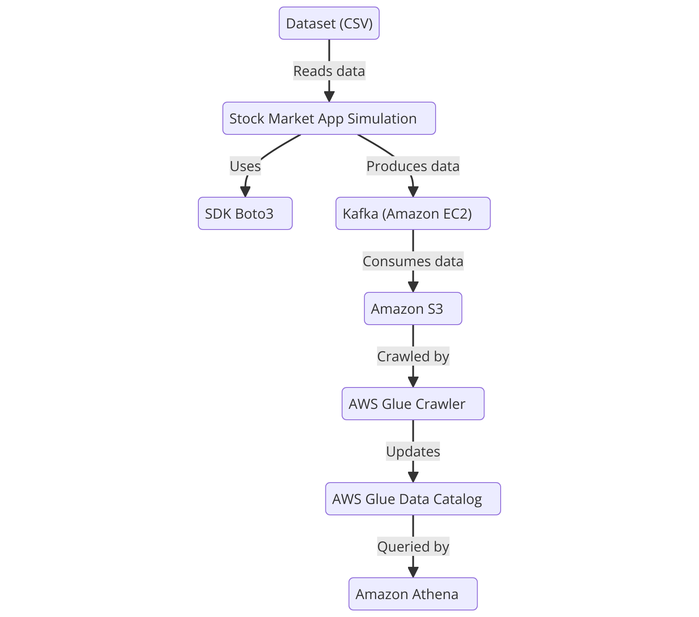

# Stock Market Kafka Real-Time Data Engineering

## Introduction
This project implements an end-to-end real-time data engineering pipeline for stock market data using Apache Kafka. The pipeline enables real-time data ingestion, processing, and analysis, leveraging cloud services and big data technologies.

---

## Tech Stack
```yaml
Programming Language: Python
Cloud Platform: Amazon Web Services (AWS)
  - S3 (Simple Storage Service)
  - Athena
  - Glue Crawler
  - Glue Catalog
  - EC2
Streaming Framework: Apache Kafka
```

---

## Architecture
The system architecture consists of:
1. ** Data Ingestion**: Real-time stock market data is streamed using Apache Kafka.
2. ** Storage**: The data is stored in AWS S3 for further processing.
3. ** Processing & Cataloging**: AWS Glue is used to transform and catalog data.
4. ** Querying & Analysis**: AWS Athena enables querying of processed stock data.

### Architecture Diagram


---

## Setup & Installation
```bash
# Install Apache Kafka and configure a Kafka cluster
# Set up an AWS environment with necessary services (S3, Glue, Athena, EC2)

# Clone the repository
git clone https://github.com/your-repo/stock-market-kafka.git
cd stock-market-kafka

# Install dependencies
pip install -r requirements.txt

# Start Kafka server
bin/zookeeper-server-start.sh config/zookeeper.properties
bin/kafka-server-start.sh config/server.properties

# Run the data streaming script
python stream_stock_data.py
```

---

## Usage
- Real-time monitoring and analysis of stock market data.
- Efficient storage and retrieval of streaming data.
- Scalable architecture using cloud-based services.

---
